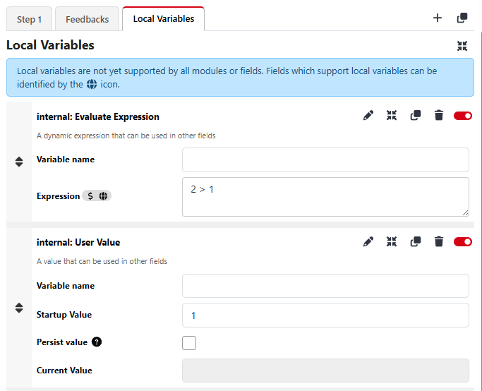

# Local Variables

Local variables were introduced in Companion 4, with user defined local variables being added in 4.1, and are a way to store data local in relation to a button.

One thing to note, because Local Variables requires changes by module developers to support, not all Actions/Feedbacks are currently able to parse Local Variables, in which case it may be needed to save the values to a custom variable, and then use that custom variable in the action/feedback. In the future support will become more universal.

For example the following Local Variables will be available on all buttons, and will each return values for the specific button they are used on.

- `$(this:page)`
- `$(this:column)`
- `$(this:row)`
- `$(this:pushed)`
- `$(this:step)`
- `$(this:step_count)`
- `$(this:button_status)`
- `$(this:actions_running)`
- `$(this:page_name)`

In addition to this, users can also create their own local variables on specific buttons by using the local variables tab, as shown here:

One common task when creating buttons is using the same value in multiple places, for example if I was to have a button that sent input `Cam1` to preview, had feedback showing the preview state of `Cam1`, and having `Cam1` on the button text, that is 3 separate places where I need to type the name of an input, potentially more if I have more actions on that button. With a local variables I could create `$(local:input)`, set that to `Cam1` and replace those values on the button text, action, and feedback, with `$(local:input)`. If I want to copy and paste that button for Cam2, I now just have to change that 1 local variable to `Cam2` and all of the other references to that local variable will return `Cam2`. By needing to only change 1 variable instead of a value in multiple places reduces the chance of user error when creating the buttons, and can significantly speed up creating a Companion setup.

Another advantage to local variable is expressions. If you need to use an expression in an action there are often extra steps involved, such as needing a custom variable, and then setting the value of that variable from an Expression, and then using that in the action. Now with local variables you can simply create a local variable that evaluates an expression, for example if I have `Cam1` to `Cam6`, I could create buttons and change a local variable of each one to a static value, or I could use the expression `Cam${$(this:column) + 1}`. Now if I use this on a button in Column 0, it'll return `Cam1`, Column 1 would be `Cam2`, and so on, which allows me to copy and paste this across buttons in columns 0 to 5 and that'll give me my preview buttons for `Cam1` to `Cam6` without needing to adjust any values at all.

While this can all can largely be achieved with custom variables, the number of custom variables needed when working with hundreds of buttons, and all the additional actions to save expression values to variables, can become unwieldly where as using local variables can be a much simpler and easier to maintain option.
