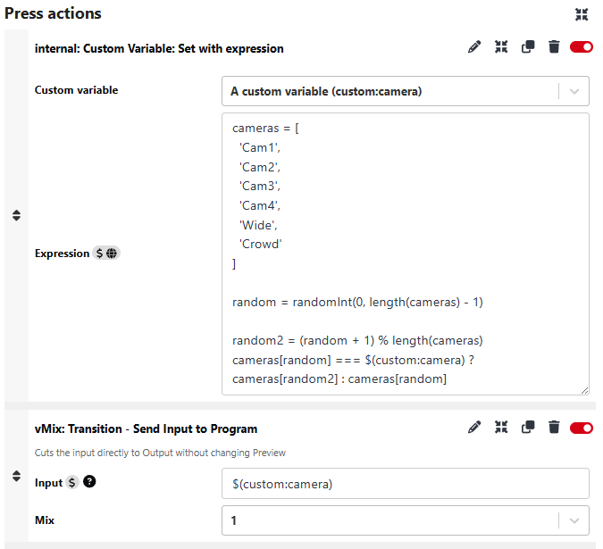

# Random Actions

There has been some interest shown in how to randomly select a camera out of a list of cameras and then perform an action such as cut to it, with this functionality being triggered periodically or within a set time window. This random selection of an item in a list and performing an action with that item can be done entirely within Companion without need of special modules, or external applications.

This example will build on some of the techniques shown in the [Expressions](./Expressions.md) guide.

## Selecting a random item from a list

Using the scenario of periodically cutting to a random camera, we would first need to create a Custom Variable to store the selected camera in, such as `$(custom:camera)`, and use an Expression to set a camera to that.

We can use an Expression when setting values to a variable, so in our expression we'll create a JSON array containing the names of the camera inputs

```
cameras = [
  'Cam1',
  'Cam2',
  'Cam3',
  'Cam4',
  'Wide',
  'Crowd',
]
```

This JSON Array is a list of 6 items, each one being a text string. Individual items in the array can be referenced by an index (starting from 0), so `cameras[0]` would be `Cam1`, `cameras[4]` would be `Wide`, etc...

Next we want to generate a random number between 0 and the last index in the array (note the - 1 at the end, this is so that while the array length is 6, the last index is 5):

```
random = randomInt(0, length(cameras) - 1)
```

This gives us a random number, so we can just end here with a new line `cameras[random]` to return a random camera. One potentially flaw with this is that it could randomly select the same camera that is already selected, and while the ideal solution would be to repeat the random number generation until a different camera is selected that's not currently easy within an Expression, so the next best thing is to check if the random camera is the same as the current camera, and if so just increment the random number by 1 and roll around to 0 if it exceeds the array length and use that, otherwise use the original random number.

```
random2 = (random + 1) % length(cameras)
cameras[random] === $(custom:camera) ? cameras[random2] : cameras[random]
```

So the final Expression looks like:

```
cameras = [
  'Cam1',
  'Cam2',
  'Cam3',
  'Cam4',
  'Wide',
  'Crowd'
]

random = randomInt(0, length(cameras) - 1)

random2 = (random + 1) % length(cameras)
cameras[random] === $(custom:camera) ? cameras[random2] : cameras[random]

```

With a new random camera set to `$(custom:camera)`, we can use that in an Action, such as the `Transition - Send Input to Program` Action in vMix.



While here the example uses Input names and uses vMix to cut to them, another example could also be using an array of button page/row/column's and using the internal Action `internal: Button: Trigger press and release` to randomly press one of those buttons.

## Random Triggering

If you wanted to automatically fire that previous Expression script to cycle through camera shots this can very easily be done with a Trigger, with the Event set to a time interval such as 10 seconds. If you want the actions to fire within a random time window then this can also very easily be achieved with triggers.

The first step would be to create a variable to store the time of the next firing of the actions, such as `$(custom:timer)`, and add an `internal: Custom Variable: Set with expression` Action to the end of the set of Actions the trigger will fire with the following Expression:

```
now = timestampToSeconds($(internal:time_hms))
random = randomInt(10, 15)
secondsToTimestamp(now + random)
```

This will create a random number between 10 and 15, add that to the current time in seconds, and save it to the `$(custom:timer)` variable as a timestamp. As you know when the trigger should fire, you can set the trigger to have a 1s interval but with a condition that compares `$(internal:time_hms)` to `$(custom:timer)` and if they match it'll fire the Actions.

There are some quirks to this, such as needing to run Test Actions at least once so that `$(custom:timer)` becomes set, otherwise the condition will never be met, and you'll also need another trigger that on Companion start will update that timer or it could be at a time in the past and so not meet the condition check correctly.
